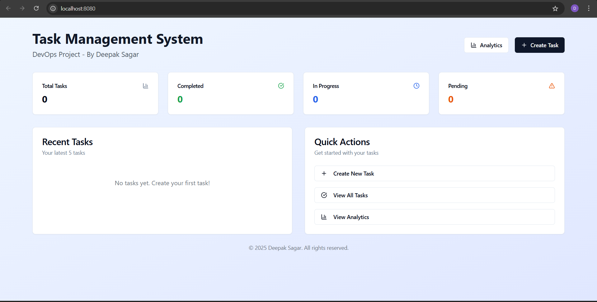

<div align="center">

# ✨ Task Management Application ✨

</div>


**A modern and responsive Task Management System built with the latest frontend technologies. Perfect for practicing DevOps workflows like CI/CD, containerization, monitoring, and infrastructure as code**

<div align="center">
<!--
 -->

[](https://react.dev/)
[](https://www.typescriptlang.org/)
[](https://vitejs.dev/)
[](https://tailwindcss.com/)
[](https://ui.shadcn.com/)


[Report Bug](https://github.com/Coding4Deep/Task-Manager-Project/issues) • [Request Feature](https://github.com/Coding4Deep/Task-Manager-Project/issues)

</div>

---



## 🚀 Features

- ✅ **Task Management**: Create, update, delete, and filter tasks
- 🔍 **Advanced Filtering**: Filter by status, priority, tags, and text search
- 📱 **Responsive Design**: Works seamlessly on desktop, tablet, and mobile devices
- 🌙 **Dark/Light Mode**: Automatically adapts to user preferences
- 📊 **Analytics Dashboard**: Visualize your task completion metrics
- 🔐 **Authentication**: User login/signup with secure data storage (coming soon)
- 👥 **Guest Mode**: Try the app without creating an account (coming soon)

---

## 🛠️ Tech Stack
### Frontend
<table>
  <tr>
    <td style="vertical-align: top; padding-right: 20px;">
      <h3></h3>
      <ul>
        <li><strong>React</strong>: Library for building user interfaces</li>
        <li><strong>TypeScript</strong>: Typed JavaScript for better developer experience</li>
        <li><strong>Vite</strong>: Lightning-fast frontend tooling</li>
        <li><strong>Tailwind CSS</strong>: Utility-first CSS framework</li>
        <li><strong>shadcn/ui</strong>: Radix-based modern UI components</li>
        <li><strong>Lucide Icons</strong>: Elegant and consistent icons</li>
        <li><strong>React Router</strong>: Routing library for single-page apps</li>
        <li><strong>React Hook Form</strong>: Form management and validation</li>
        <li><strong>Zod</strong>: TypeScript-first schema validation</li>
        <li><strong>Recharts</strong>: Library for building responsive charts</li>
        <li><strong>TanStack Query</strong>: Data fetching and caching layer</li>
      </ul>
    </td>
    <td style="vertical-align: top; max-width: 300px;">
      
    </td>
  </tr>
</table>


---

## 📦 Installation

```bash
# Clone the repository
git clone https://github.com/Coding4Deep/Task-Manager-Project.git

# Navigate to project directory
cd Task-Manager-Project

# Install dependencies
npm install

# Start development server
npm run dev
```

---

# 🐳 **Continerization**


A Dockerfile is provided for easy containerization:


### Build the Docker Image

```bash
docker build -t task-manager-ui .
```

### Run the Docker Container

```bash
docker run -p 80:80 task-manager-ui
```

Your application will be available at `http://localhost:80`

---

## 🖥️ Usage

* Navigate to the **Tasks** page to manage tasks
* Create new tasks using the **"New Task"** button
* Filter tasks using the search bar and filters
* Edit or delete tasks inline
* View visual task analytics on the **Analytics** page

---

## 🧪 DevOps Practice Benefits

This project is great for DevOps practice. You can:

* Set up **CI/CD pipelines** with GitHub Actions or Jenkins
* Containerize the app using **Docker**
* Deploy to **Kubernetes** or **AWS ECS**
* Implement **monitoring** with Prometheus & Grafana
* Use **Secrets Management** with Vault or GitHub Secrets
* Experiment with **Reverse Proxies** like NGINX

---

## 🔜 Upcoming Features

* 🔐 User authentication with login/signup
* 💾 Cloud-based data storage
* 📱 Progressive Web App (PWA) support
* 📅 Calendar integration for tasks
* 📊 Advanced analytics and reporting

---

## 🤝 Contributing

Contributions are welcome!

```bash
# Fork the repository
# Create your branch
git checkout -b feature/amazing-feature

# Commit your changes
git commit -m 'Add some amazing feature'

# Push to the branch
git push origin feature/amazing-feature

# Open a Pull Request on GitHub
```

---

## 📄 License

Distributed under the [MIT License](./LICENSE). See the `LICENSE` file for more information.


---

> Crafted with ❤️ by **Deepak Sagar**

  <!--
<div align="center">
  


</div>


---


